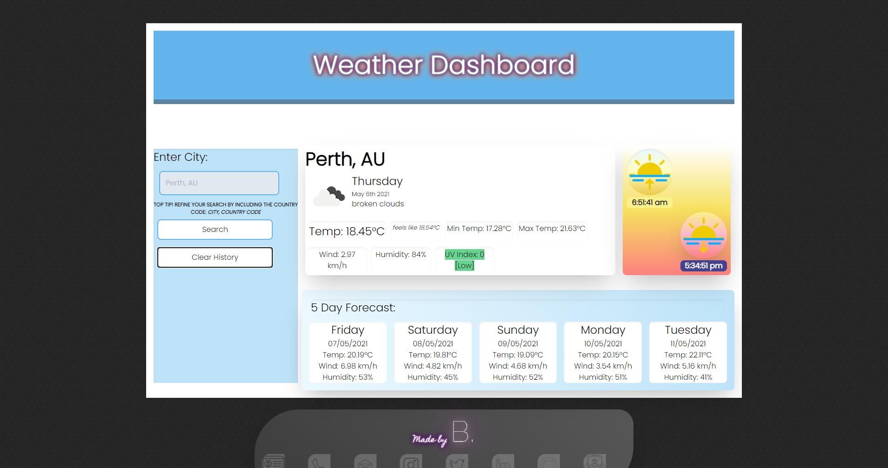
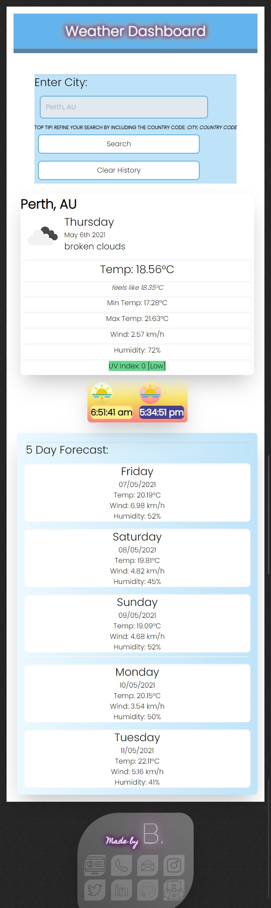

# Weather-Dashboard

### This Github repository contains the code for a weather dashboard, allowing a user to search for weather data based on entering a location. 

### The weather dashboard displays the current weather data for the location entered by the user, including weather conditions, temperature information, wind speed, humidity, the UVI and sunrise/sunset times. It also displays weather forcast details for the next 5 days 

---

## Motivation & Research

I was motivated to develop this website to provide detailed weather data based on a users location, while practicing a diverse set of skills across web development languages and tools.

My research focussed primarily on the OpenWeatherMap API and object syntax in order to get the information required to populate the website with the returned data. Branding and front end web development to provide a great user experience and an attractive interface for the end user to access the weather information returned from the API was also key to the success of this project.

##  Development
### Web development technologies 
Development of the website was centered around the use of the OpenWeatherMap API to build the JavaScript to create a functional application; working with OpenAPI's to access, retrieve and store weather data. I was also able to further develop my CSS skills, by utilising TailwindCSS to develop the website's layout and design combined with my own styling for the website to be on brand with my portfolio of development work. 

The languges and tools used to build this website include:

* CSS Framework :
    * Bootstrap https://getbootstrap.com/
* Google Fonts :
    * https://fonts.google.com/
* Font Awesome Icons :
    * https://fontawesome.com/icons?d=gallery&p=2
* JavaScript & jQuery
    * With a particular focus on localStorage functions
* Web APIs :
    * MomentJS : https://momentjs.com/
    * Web Storage : https://developer.mozilla.org/en-US/docs/Web/API/Web_Storage_API

### Graphic design and branding
Working from a pre-existing mockup image of the expected UI and functionality I developed the website layout and user interface using the TailwindCSS framework. Using the provided image as a starting point I performed heavy customisations of my CSS styling, creating a cohesive brand across my application portfolio while maintaining the desired functionality for the application. 

Customisations included the use of of keyframe animations, customised fonts and the addition of an on-brand footer with links to contact information, including my Github profile and a download link of my current resume.

### Challenges 

The development of this application required the use of the MomentJS and Web Storage APIs, both new areas of study within my web development career.
In using the MomentJS library, I was able to aquire new knowledge and understanding of parsing, validating, manipulating and displaying date & time in JavaScript.
The successful implementation of the Web Storage API assisted me in gaining a much greater understanding of browser based local storage use cases allowing my application to accept and store user input for use at a later time.
Application of the aquired development skills allowed for successful implementation of local storage functionality within a time sensitive browser based application.

## Future development opportunities

I aim to continue to develop this website to include:
* An enhanced design, refining and improving the layout and asthetics to enhance user experience.
* Resposive web design to allow the application to function optimally across multiple devices and screen sizes.
* User refinable time inputs, allowing for the greater flexibility to book appointments or events in shorter time segments - eg meeting from 0930-1030 or 1145-1200.
* Time zone awareness within the application, allowing users to adjust timezones for their events, to better cater to meetings or events that occur across multiple time zones.
* Alerts and reminder functionality to notify the user about upcoming events or appointments they have previously booked within the application.

**Thank you for visiting.**

### Repository Link:

* https://github.com/blmccavanagh/Weather-Dashboard

### Deployed Application Link:

* https://blmccavanagh.github.io/Weather-Dashboard/

### Application Screenshots:

---

*Desktop Browser View* 

---

*Mobile Browser View* 

---

*Weather Dashboard Demo*

---